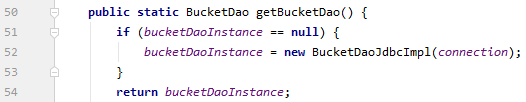
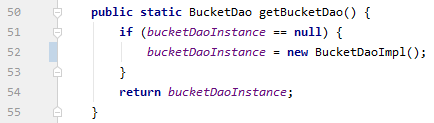
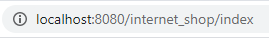
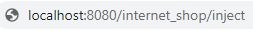

# Internet Shop

# Table of Contents

[Project purpose](#purpose)

[Project structure](#structure)

[For developer](#developer)

[Author](#author)

## Project purpose

This project is a simple version of internet shop.

This shop has basic functions for online store such as:

- Registration and log in forms
- Bucket and order services
- Two roles: User and Admin

This project has authentication and authorization filters, DAO and Service layers, Servlets and JSP pages.

DAO layer has two implementations: inner storage based on List and outer storage based on MySQL DB.

## Project structure

- Java 11
- Maven
- MavenCheckstylePlugin 3.1.0
- javax.servlet 3.1.0
- javax.jstl 1.2
- mysql-connector-java 8.0.18
- log4j 2.13.0

## For developer
To run this project you need to install:

- <a href="https://www.oracle.com/technetwork/java/javase/downloads/jdk11-downloads-5066655.html">Java 11</a>
- <a href="https://tomcat.apache.org/download-90.cgi">Tomcat</a>
- <a href="https://www.mysql.com/downloads/">MySQL 8</a> (optional)

Add this project to your IDE as Maven project.

Add Java SDK 11 in project structure.

Configure Tomcat:
- Add artifact
- Add Java SDK 11

Change a path to your Log file in **src/main/resources/log4j2.xml** on line 4.

To work with MySQL you need to:
- Use file **src/main/resources/init_db.sql** to create schema and all the tables required by this app in MySQL DB
- Change username and password to match with MySQL in **src/main/java/mate/academy/internetshop/factory/Factory.java** class on 42 line

To work with inner Storage you need to:

- Change **src/main/java/mate/academy/internetshop/factory/Factory.java**
    1. On line 52 **new BucketDaoJdbcImpl(connection)** to **new BucketDaoImpl()**
    2. On line 66 **new ItemDaoJdbcImpl(connection)** to **new ItemDaoImpl()**
    3. On line 80 **new OrderDaoJdbcImpl(connection)** to **new OrderDaoImpl()**
    4. On line 94 **new UserDaoJdbcImpl(connection)** to **new UserDaoImpl()**
    
        
- Import corresponding classes from **mate.academy.internetshop.dao.impl**

Run the project:

Main page is at URL: .../{context_path}/index

For MySQL DAO only **on first run** of the project, for inner Storage **on every launch**, to create default users open URL: .../{context_path}/inject

By default there are one user with an USER role (login = "user", password = "123"), 
one with an ADMIN role (login = "admin", password = "123"), 
and one with both roles (login = "superuser", password = "123").

## Author
[Andrii Voloshyn](https://github.com/ElvenNurse)

